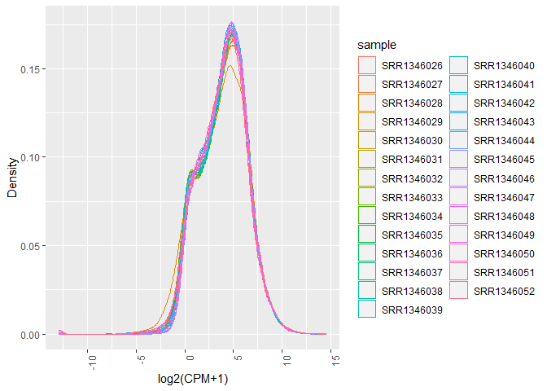
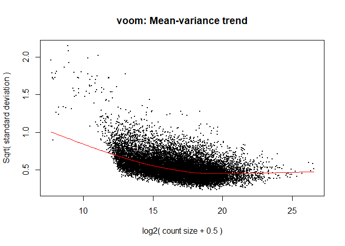

‘Downstream’ Analysis: from counts to Differential Expression
================
Cindy(Xiao Yu) Zhang

**Reminder:** When answering the questions, it is not sufficient to
provide only code. Add explanatory text to interpret your results
throughout.

### Background

The dataset used for this assignment has been published by [Li et al. in
2016](https://journals.plos.org/plospathogens/article?id=10.1371/journal.ppat.1005511),
as well as included in a follow-up study by [Houston-Ludlam et al. also
in
2016](https://journals.plos.org/plosone/article?id=10.1371/journal.pone.0159197).
You should recognize the follow-up study, “Comparative Transcriptome
Profiling of Human Foreskin Fibroblasts Infected with the Sylvio and Y
Strains of Trypanosoma cruzi” as this is the paper you were asked to
review for the Paper Critique. The data used in this follow-up study was
a combination of newly generated data (for the Sylvio strain and one
replicate of Y strain), as well as the data generated in the original Li
et al. article (all for the Y strain). In this assignment, you’ll be
working with the Y strain data generated in the original article.

Although the processed data for this study are not available in GEO, the
*raw* RNA-Seq reads have been submitted to NCBI SRA under the accession
[SRP043008](https://trace.ncbi.nlm.nih.gov/Traces/sra/?study=SRP043008).
Fortunately, they have also been preprocessed using a standardized
pipeline from raw reads to mapped gene and transcript level counts, and
formatted into `RangedSummarizedExperiment` objects (ready for analysis
in R!) as part of the [Recount2
project](https://jhubiostatistics.shinyapps.io/recount/). The
`RangedSummarizedExperiment` experiment class functions much the same as
the `SummarizedExperiment` class we learned about in lecture. We can
read the data into R in this format using the [recount
package](https://bioconductor.org/packages/release/bioc/html/recount.html).

We can also get metadata (mapping of sample IDs to time points,
infection status, batch, etc) from [Table
S1](https://journals.plos.org/plospathogens/article/file?type=supplementary&id=info:doi/10.1371/journal.ppat.1005511.s011)
in the original study.

Some helper code to read the data in is provided.

### Load libraries

Note: only a few libraries are provided for the initial steps; add
additional libraries as needed for the rest of the analyses.

``` r
library(recount)
library(openxlsx)
library(tidyverse)
library(limma)
library(edgeR)
library(pheatmap)
library(knitr)
```

### Question 1: Importing the data and getting familiar with it (3 POINTS)

First, we’ll download and read the gene-level counts
`RangedSummarizedExperiment` object for project id “SRP043008” into R
using the `recount` package. We’ll add a column called `sample` to the
`colData` slot that contains the `run` variable (since this will serve
as our sample ID and is easier). And we’ll also add the sample IDs to
the colnames of the object. Note that there’s nothing you need to add
here.

``` r
download_study(project = "SRP043008")
```

    ## 2023-02-23 13:55:45 downloading file rse_gene.Rdata to SRP043008

``` r
load(file.path("SRP043008", "rse_gene.Rdata"))
colData(rse_gene)$sample <- colData(rse_gene)$run
colnames(rse_gene) <- colData(rse_gene)$sample
```

Now we’ll add sample IDs to the `colnames` of the object to the SRR
sample IDs: Use the IDs in the `run` variable of the `colData` slot.
Note that there’s nothing you need to add here.

``` r
colnames(rse_gene) <- colData(rse_gene)$sample
```

A. Investigate the object just loaded. How many genes are there? (0.5
pt)

``` r
length(unique(rownames(rse_gene)))
```

    ## [1] 58037

``` r
# 58037 genes  
```

B. How many samples are there? (0.5 pt)

``` r
length(unique(colnames(rse_gene)))
```

    ## [1] 27

``` r
# 27 samples 
```

Here, we convert the `RangedSummarizedExperiment` object into a
[`DGEList`](https://rdrr.io/bioc/edgeR/man/DGEList.html) object (for use
with `limma` and/or `edgeR`). As we discussed in lecture, this format is
similar to `SummarizedExperiment`, but has some special slots, including
one for normalization factors, that are important for methods like
`limma` and `edgeR`. We’ll include the `colData` of the
`RangedSummarizedExperiment` object as the `samples` data.frame in the
`DGEList`. Note there’s nothing you need to add here.

``` r
dge <- DGEList(counts = assays(rse_gene)$counts,
               samples = colData(rse_gene))
```

Next, we’ll read in the metadata from [Table
S1](https://journals.plos.org/plospathogens/article/file?type=supplementary&id=info:doi/10.1371/journal.ppat.1005511.s011)
in the original study. Note that this is an Excel file with some
nonstandard formatting, so this step needs to be done with care - the
`read.xlsx` package is suggested since this can skip some rows, and fill
in merged cells. Note there’s nothing you need to add here.

``` r
mdat <- read.xlsx("https://journals.plos.org/plospathogens/article/file?type=supplementary&id=info:doi/10.1371/journal.ppat.1005511.s011",
                  startRow = 3, fillMergedCells = TRUE) %>%
  mutate(sample=Accession.Number)
```

C. Subset the metadata to include only those samples that we have gene
counts for (Table S1 also includes the non-host (non-human) samples),
and add this information to the `samples` slot of the `DGEList` object
(the `samples` slot of the `DGEList` is where the sample metadata is
stored - analogous to `colData()` for a `SummarizedExperiment`). HINT:
perform a join operation by sample id (beginning with “SRR”). (1 pt)

    ## [1] 8

``` r
# the below line combines the metadata to dge$samples by keeping every record in dge$samples. Some of the samples metadata
dge$samples <- left_join(dge$samples, mdat, by="sample") 
```

D. How many variables of interest are in our experimental design? Are
these factors (categorical) or continuous? If factors, how many levels
are there? List out the levels for each factor. (1 pt)

- 3 variables of interest are in the experimental design: developmental
  stage in (hours post infection or hpi), infection status and batch.
  The hpi can be considered as categorical with 6 levels, however, in
  later step of this assignment we convert it into a \* continuous
  variable\* . The infection status and batch are both categorical
  variables. Infection status has 2 and batch has 5 levels.

``` r
# Levels of infection status 
table(dge$samples$Infected)
```

    ## 
    ##  N  Y 
    ##  9 18

``` r
# Levels of developmental stage
table(dge$samples$Developmental.stage)
```

    ## 
    ##  Amastigote 12hr  Amastigote 24hr Amastigote 4 hpi  Amastigote 48hr 
    ##                3                4                4                7 
    ##   Amastigote 6hr  Amastigote 72hr 
    ##                4                5

``` r
# Levels of batch
table(dge$samples$Batch)
```

    ## 
    ##  A  B  C  D  E 
    ## 10  4  5  6  2

### Question 2: Remove lowly expressed genes (2 POINTS)

A. Remove lowly expressed genes by retaining genes that have CPM $>$ 1
in at least 25% of samples. (1 pt)

``` r
# make a filtered dge_count named dge2 to store the cpm normalized counts
dge2 <- cpm(dge$counts)

threshold <- dge2 >1
 
# we would keep genes that have CPM >1 in at least 25%x27=6.75 of samples (i.e. 7 and above)

keep <- rowSums(threshold) > 6.75 

dge <- dge[keep,] 
# dge now contains only the non-lowly expressed genes in their count table 
```

B. How many genes are there after filtering? (1 pt)

``` r
length(keep)
```

    ## [1] 58037

``` r
# 16681 genes were left after filtering. 
```

### Question 3: Data wrangling (2 POINTS)

The different character values of `Developmental.stage` refer to time
points - these can be thought of as categorical or on a continous axis.
In order to make graphing easier, it will be helpful to convert this
variable to a numeric representation.

Create a new column in the *samples metadata* tibble. Call it “hpi”
(which stands for hours post infection) and populate it with the
appropriate numeric values.

``` r
# This code replace the non-numeric character with nothing i.e. take out.  
dge$samples$hpi <- gsub("[^0-9]", "", dge$samples$Developmental.stage) %>%
  as.numeric()

#Alternatively, this is what we learn from class
dge$samples <- dge$samples %>% 
  mutate(hpi = case_when(
    grepl("Amastigote 4 hpi", Developmental.stage) ~ 4,
    grepl("Amastigote 6hr", Developmental.stage)~ 6,
    grepl("Amastigote 12hr", Developmental.stage)~ 12,
    grepl("Amastigote 24hr", Developmental.stage) ~ 24,
    grepl("Amastigote 48hr", Developmental.stage) ~ 48,
    grepl("Amastigote 72hr", Developmental.stage) ~ 72,
  ))

as.numeric(dge$samples$hpi)
```

    ##  [1]  4  4  4  4  6  6  6  6 12 12 12 24 24 24 24 48 48 48 48 48 48 48 72 72 72
    ## [26] 72 72

Remove the `eval=FALSE` tag in the next chunk so that you can check that
your added variable looks as expected.

``` r
# check the result
table(dge$samples$hpi, dge$samples$Developmental.stage)
```

    ##     
    ##      Amastigote 12hr Amastigote 24hr Amastigote 4 hpi Amastigote 48hr
    ##   4                0               0                4               0
    ##   6                0               0                0               0
    ##   12               3               0                0               0
    ##   24               0               4                0               0
    ##   48               0               0                0               7
    ##   72               0               0                0               0
    ##     
    ##      Amastigote 6hr Amastigote 72hr
    ##   4               0               0
    ##   6               4               0
    ##   12              0               0
    ##   24              0               0
    ##   48              0               0
    ##   72              0               5

``` r
class(dge$samples$hpi)
```

    ## [1] "numeric"

### Question 4: Assessing overall distributions (4 POINTS)

A. The expression values are raw counts. Calculate TMM normalization
factors (and add them to your `DGEList` object). (1 pt)

``` r
dge<-  calcNormFactors(dge, method="TMM")
```

B. Examine the distribution of gene expression on the scale of
$\sf{log_{2}}$ CPM across all samples using box plots (with samples on
the x-axis and expression on the y-axis). (1 pt)

- Hint 1: Add a small pseudo count of 1 before taking the log2
  transformation to avoid taking log of zero - you can do this by
  setting `log = TRUE` and `prior.count = 1` in the `cpm` function.
- Hint 2: To get the data in a format amenable to plotting with ggplot,
  some data manipulation steps are required. Take a look at the
  `pivot_longer` function in the tidyr package to first get the data in
  tidy format (with one row per gene and sample combination).

``` r
dge$log2cpm <- cpm(dge$counts, log=TRUE, prior.count=1)%>% as.data.frame()


dge$log2cpm <- dge$log2cpm %>% 
  as.data.frame() %>% 
  rownames_to_column("gene") %>% 
  pivot_longer(cols = 2:ncol(.), 
               values_to = "log2cpm",
               names_to = "sample" ) 

ggplot(data = dge$log2cpm, aes(x = sample, y = log2cpm, color = sample)) +
  geom_boxplot() + 
  labs(x="Sample", y = "log2(CPM+1) gene expession counts", color = "sample" ) + 
  theme(axis.text.x = element_text(angle = 90, hjust = 1))
```

<!-- -->

C. Examine the distribution of gene expression in units of
$\sf{log_{2}}$ CPM across all samples using overlapping density plots
(with expression on the x-axis and density on the y-axis; with one line
per sample and lines coloured by sample). (1 pt)

``` r
dge$log2cpm %>% 
  ggplot(aes(x = log2cpm, color = sample)) + 
  geom_density() +
  labs(x="log2(CPM+1)", y = "Density") + 
  theme(axis.text.x = element_text(angle=90, hjust=1))
```

<!-- -->

D. Which sample stands out as different, in terms of the distribution of
expression values, compared to the rest? (1 pt)

The distribution of **SRR1346028** stands out as different from other
distributions in that it has a relatively lower density around the range
2 to 8 log2(CPM+1) and higher density around -5 to 0 log2(CPM+1)
compared to other samples.

### Question 5: Single gene graphing (3 POINTS)

A. Find the expression profile for the gene *OAS* (Ensembl ID
ENSG00000089127). Make a scatterplot with (numeric) hours post-infection
(`hpi`) on the x-axis and expression value in log2(CPM + 1) on the
y-axis. Color the data points by infection status, and add in a
regression line for each one. (2 pt)

``` r
expressionDataForGene <- dge$log2cpm %>% 
  filter(grepl("ENSG00000089127", gene))
#integrate the sample metadata 

expressionDataForGene <- expressionDataForGene %>% left_join(dge$samples[,c("sample", "hpi", "Infected")], by = "sample") 

ggplot(data = expressionDataForGene, aes(x = hpi, y = log2cpm, color=Infected)) +
  geom_point() +
  geom_smooth(method="lm")+
  labs(x = "hours post infection", y = "log2(CPM+1) gene expression counts")
```

    ## `geom_smooth()` using formula = 'y ~ x'

<!-- -->

B. Is there sign of interaction between infection status and hours post
infection for **OAS**? Explain using what you observed in your graph
from the previous question. (1 pt)

**Yes. there appears to be an interaction between infection status and
hpi since the two regression lines are not parallel to each other. The
log2(CPM + 1) normalized gene expression counts appear to increase with
hours post infection in infected individuals while this is no changing
trend in uninfected samples**

### Question 6: How do the samples correlate with one another? (4 POINTS)

A. Examine the correlation **between samples** using a heatmap with
samples on the x axis and the y axis, and colour indicating correlation
between each pair of samples. Again, use the log2 transformed CPM
values. Display batch (`Batch`), hours post infection (`hpi`), and
infection status (`Infected`) for each sample in the heatmap. (2 pt)

- Hint: Consider using `pheatmap()` with annotations and `cor` to
  correlate gene expression between each pair of samples.

``` r
# correlation function corr() takes matrix as an input. 

dge3 <- cpm(dge$counts, log=TRUE, prior.count=1)
corr <- cor(dge3)

# make annotation columns
set.seed(4)
annot <- dge$samples[,c("Batch", "Infected", "hpi")]
# be sure to assign rowname for the annotation table
rownames(annot) <- colnames(corr)

pheatmap(corr, annotation_col = annot, cluster_rows = TRUE )
```

<!-- -->

B. Among the variables `Batch`, `hpi`, and `Infected`, which one seems
to be most strongly correlated with clusters in gene expression data? (1
pt)

- Hint: Consider using ‘cluster_rows=TRUE’ in `pheatmap()`.

The infection Status (labeled as “infected”) appears to have the
strongest correlation with the clusters in gene expression data.All the
clusters seem to be composed mostly of

C. There is a sample whose expression values do not correlate as highly
with other samples of the same `hpi`, and in general. Identify this
sample by its ID. (1 pt)

\*\* SRR1346028 \*\*

### Question 7: Construct linear model for Differential expression analysis (4 POINTS)

A. First set up a model matrix with hours post infection (`hpi`),
infection status (`Infection`), and the interaction between them as
covariates. Then calculate variance weights with voom, and generate the
mean-variance trend plot. (2 pt)

- Hint: use the `DGEList` object as input to voom, since you want to
  input raw counts here (voom will automatically transform to log2 CPM
  internally).

``` r
#Setting up model design matrix
modm <- model.matrix(~ hpi*Infected, data = dge$samples)
head(modm) %>% kable()
```

| (Intercept) | hpi | InfectedY | hpi:InfectedY |
|------------:|----:|----------:|--------------:|
|           1 |   4 |         0 |             0 |
|           1 |   4 |         1 |             4 |
|           1 |   4 |         1 |             4 |
|           1 |   4 |         1 |             4 |
|           1 |   6 |         0 |             0 |
|           1 |   6 |         1 |             6 |

``` r
#estimate voom weights and plot Median-Variance trend
vw <- voom(dge, 
           design = modm, plot = TRUE, span = 0.5)
```

<!-- -->

B. Use limma (`lmFit` and `eBayes`) to fit the linear model with the
model matrix you just created. (1 pt)

``` r
# Fitting weighted limma
lvfit <- lmFit(vw, model.matrix(~ hpi*Infected, data = dge$samples))
#Empirical Bayes moderated variances 
lvfitEb <- eBayes(lvfit) 
lvfitEb
```

    ## An object of class "MArrayLM"
    ## $coefficients
    ##                    (Intercept)          hpi   InfectedY hpi:InfectedY
    ## ENSG00000000003.14    3.938421  0.009970700  0.07104774  -0.003772279
    ## ENSG00000000419.12    4.946847 -0.005347600  0.19121834  -0.001885539
    ## ENSG00000000457.13    3.604565  0.005142183  0.09104361  -0.002972930
    ## ENSG00000000460.16    3.937463 -0.021210376  0.17129516   0.002424709
    ## ENSG00000000971.15    3.980039  0.034421935 -0.10188059   0.015394162
    ## 16676 more rows ...
    ## 
    ## $stdev.unscaled
    ##                    (Intercept)         hpi InfectedY hpi:InfectedY
    ## ENSG00000000003.14   0.1438327 0.003135718 0.1665771   0.003883388
    ## ENSG00000000419.12   0.1315725 0.002985533 0.1529011   0.003697685
    ## ENSG00000000457.13   0.1511647 0.003335274 0.1747212   0.004128578
    ## ENSG00000000460.16   0.1520228 0.003649921 0.1748168   0.004501472
    ## ENSG00000000971.15   0.1384749 0.002940024 0.1603235   0.003562087
    ## 16676 more rows ...
    ## 
    ## $sigma
    ## [1] 0.6477403 1.0785273 0.5858558 0.9263784 2.0544462
    ## 16676 more elements ...
    ## 
    ## $df.residual
    ## [1] 23 23 23 23 23
    ## 16676 more elements ...
    ## 
    ## $cov.coefficients
    ##                (Intercept)           hpi    InfectedY hpi:InfectedY
    ## (Intercept)    0.354572596 -0.0065603394 -0.354572596  0.0065603394
    ## hpi           -0.006560339  0.0001767756  0.006560339 -0.0001767756
    ## InfectedY     -0.354572596  0.0065603394  0.489431730 -0.0092334937
    ## hpi:InfectedY  0.006560339 -0.0001767756 -0.009233494  0.0002668819
    ## 
    ## $pivot
    ## [1] 1 2 3 4
    ## 
    ## $rank
    ## [1] 4
    ## 
    ## $Amean
    ## ENSG00000000003.14 ENSG00000000419.12 ENSG00000000457.13 ENSG00000000460.16 
    ##           4.229751           4.871291           3.772596           3.423970 
    ## ENSG00000000971.15 
    ##           5.322914 
    ## 16676 more elements ...
    ## 
    ## $method
    ## [1] "ls"
    ## 
    ## $design
    ##   (Intercept) hpi InfectedY hpi:InfectedY
    ## 1           1   4         0             0
    ## 2           1   4         1             4
    ## 3           1   4         1             4
    ## 4           1   4         1             4
    ## 5           1   6         0             0
    ## 22 more rows ...
    ## 
    ## $df.prior
    ## [1] 3.771644
    ## 
    ## $s2.prior
    ## [1] 0.8134078
    ## 
    ## $var.prior
    ## [1] 19.67033077  0.01229396  1.44514355  0.01229396
    ## 
    ## $proportion
    ## [1] 0.01
    ## 
    ## $s2.post
    ## [1] 0.4750525 1.1139387 0.4094670 0.8518698 3.7407158
    ## 16676 more elements ...
    ## 
    ## $t
    ##                    (Intercept)       hpi  InfectedY hpi:InfectedY
    ## ENSG00000000003.14    39.72773  4.613365  0.6188198    -1.4093608
    ## ENSG00000000419.12    35.62319 -1.697096  1.1849181    -0.4831423
    ## ENSG00000000457.13    37.26432  2.409387  0.8143186    -1.1253167
    ## ENSG00000000460.16    28.06217 -6.296197  1.0616354     0.5836043
    ## ENSG00000000971.15    14.86069  6.053506 -0.3285617     2.2344680
    ## 16676 more rows ...
    ## 
    ## $df.total
    ## [1] 26.77164 26.77164 26.77164 26.77164 26.77164
    ## 16676 more elements ...
    ## 
    ## $p.value
    ##                     (Intercept)          hpi InfectedY hpi:InfectedY
    ## ENSG00000000003.14 2.454136e-25 8.764249e-05 0.5412653    0.17023944
    ## ENSG00000000419.12 4.315816e-24 1.012764e-01 0.2464622    0.63292249
    ## ENSG00000000457.13 1.322501e-24 2.313253e-02 0.4226471    0.27044270
    ## ENSG00000000460.16 2.180040e-21 1.010628e-06 0.2978849    0.56437153
    ## ENSG00000000971.15 1.884054e-14 1.902554e-06 0.7450432    0.03400142
    ## 16676 more rows ...
    ## 
    ## $lods
    ##                    (Intercept)         hpi InfectedY hpi:InfectedY
    ## ENSG00000000003.14    47.98388 -0.04672854 -6.387558     -6.954900
    ## ENSG00000000419.12    45.19009 -6.79238032 -5.967017     -7.875987
    ## ENSG00000000457.13    46.31032 -5.37698303 -6.201602     -7.245462
    ## ENSG00000000460.16    38.97892  4.58448541 -5.973192     -7.624717
    ## ENSG00000000971.15    22.71593  3.73605117 -6.563699     -5.661835
    ## 16676 more rows ...
    ## 
    ## $F
    ## [1] 4386.060 2947.932 3646.273 1488.340 1020.061
    ## 16676 more elements ...
    ## 
    ## $F.p.value
    ## [1] 2.804324e-37 5.662752e-35 3.309709e-36 5.156424e-31 7.868197e-29
    ## 16676 more elements ...

C. Print the 10 top-ranked genes by adjusted p-value for the
`hpi:InfectedY` coefficient using `topTable` (1 pt)

``` r
#use signif to round off floats
signif(topTable(lvfitEb, coef= "hpi:InfectedY", sort.by= "p", number = 10),3) %>%
  kable()
```

|                    |  logFC | AveExpr |    t | P.Value | adj.P.Val |    B |
|:-------------------|-------:|--------:|-----:|--------:|----------:|-----:|
| ENSG00000137285.9  | 0.0512 |   6.030 | 7.30 | 1.0e-07 |   0.00131 | 7.14 |
| ENSG00000137267.5  | 0.0421 |   6.590 | 6.90 | 2.0e-07 |   0.00178 | 6.09 |
| ENSG00000139531.12 | 0.0180 |   4.090 | 6.70 | 4.0e-07 |   0.00199 | 5.71 |
| ENSG00000103966.10 | 0.0326 |   6.400 | 6.48 | 6.0e-07 |   0.00264 | 4.99 |
| ENSG00000281028.1  | 0.0322 |   4.600 | 6.22 | 1.2e-06 |   0.00409 | 4.45 |
| ENSG00000106785.14 | 0.0471 |   6.450 | 5.92 | 2.7e-06 |   0.00546 | 3.53 |
| ENSG00000002549.12 | 0.0534 |   6.610 | 5.92 | 2.7e-06 |   0.00546 | 3.52 |
| ENSG00000147509.13 | 0.0459 |   0.803 | 5.92 | 2.7e-06 |   0.00546 | 4.19 |
| ENSG00000272921.1  | 0.0180 |   4.750 | 5.84 | 3.3e-06 |   0.00546 | 3.42 |
| ENSG00000038210.12 | 0.0308 |   5.590 | 5.81 | 3.6e-06 |   0.00546 | 3.26 |

### Question 8: Interpret model (2 POINTS)

For the gene CDC20 (Ensembl id ENSG00000117399), what is the numeric
value of the coeffcient of the `hpi` term? What is the interpretation of
this value in terms of the effect of time on expression? Be sure to
include units and indicate which samples this applies to.

``` r
topTable(lvfitEb,number = Inf) %>% 
  rownames_to_column(var = "gene")%>% 
  filter(grepl("ENSG00000117399", gene)) %>% 
  kable()
```

    ## Removing intercept from test coefficients

| gene               |        hpi | InfectedY | hpi.InfectedY |  AveExpr |        F | P.Value | adj.P.Val |
|:-------------------|-----------:|----------:|--------------:|---------:|---------:|--------:|----------:|
| ENSG00000117399.13 | -0.0686189 | 0.0851386 |     0.0162618 | 5.624199 | 60.16853 |       0 |         0 |

- The coefficient of the hpi term is negative: \$-0.0696882. For
  non-infected samples, with one unit of hpi increase (in hour), the
  normalized expression of the *CDC20* gene (in log2(CPM+1)) will be
  decreased by 0.0696882. For infected samples, with one unit of hpi
  increase (in hour), the normalized expression of the *CDC20* gene (in
  log2(CPM+1)) will be increased by 0.0177337.

### Question 9: Quantify the number of genes differentially expressed (3 POINTS)

Using the linear model defined above, determine the number of genes
differentially expressed by infection status *at any time point* at an
FDR (use adjust.method = “fdr” in `topTable`) less than 0.05.

- Hint: in other words, test the null hypothesis that all coefficients
  involving infection status are equal to zero.

``` r
# look for genes where coefficients for infection status are statistically significant after adjusting for multi-testing

topTable(lvfitEb, number = Inf, coef = c("hpi:InfectedY", "InfectedY"), adjust.method = "fdr", p.value = 0.05) %>%
  nrow()
```

    ## [1] 2006

### Question 10: Interpret the interaction term (3 POINTS)

Explain what you are modeling with the interaction term. For a
particular gene, what does a significant interaction term mean?

- With the interaction term hpi:infectedY, I am modeling the conditional
  effect of infection status conditioned on the effect of hpi.
  hpi:InfectedY is the difference in slopes between infected and
  noninfected individuals.

- A significant interaction term for a particular gene means that the
  effects of hpi on expression of this particular gene are different
  between an infected and uninfected sample.

### **Bonus Question** (2 POINTS - extra credit)

Compare your DE results to those obtained by [Li et
al. (2016)](https://journals.plos.org/plospathogens/article?id=10.1371/journal.ppat.1005511).
Discuss any discrepancies. List at least three explanations for these
discrepancies.

There are lots of discrepancies between my and this paper’s DE results.

1)The original paper adjusted for uninfected samples by subtracting
counts rather than including infection status as a covariate as in my
analysis

2)The paper treated hpi as a categorical variable and reported DE genes
for each time point separately, while we considered hpi a continuous
variable

3)  The original paper included Batch as a covariate but I did not in
    this analysis

4)  The original paper also included a filter for logFC when defining
    significance but I did not

5)  The paper used Storey’s q-values instead of BH/FDR for multiple
    testing correction
